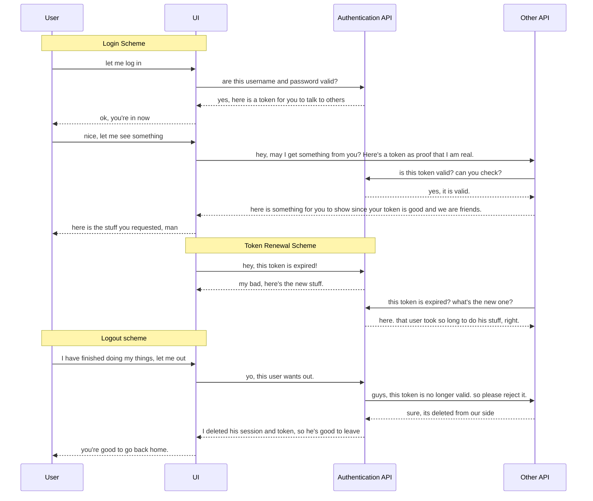

# JWTAuthentication
A sample of service that utilize the .net core API and JWT process.

## How It Works?

UI will contact this API, JWT authentication, for user login. They will get a token which will allow the UI to talk with other related system (still being developed by now). Below is a simple descriptive diagram that I made using [Mermaid](https://mermaidjs.github.io/).

So in order to properly use this, you need to fill in the audience list in the database. I add a controller for testing purpose. You may also need to prefill the user tables. Then you may test the token.
